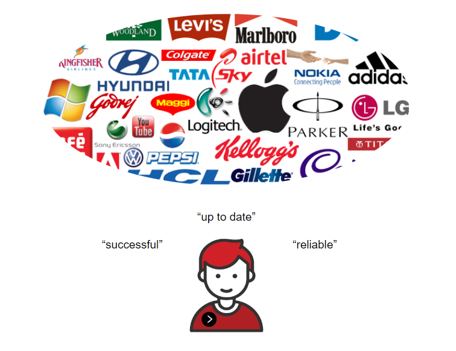
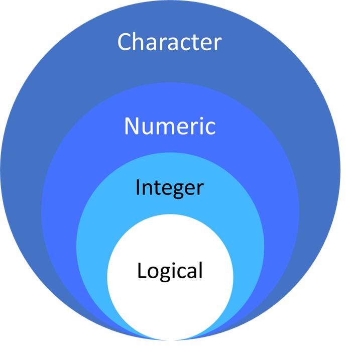
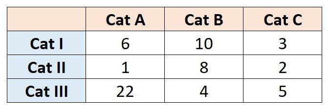
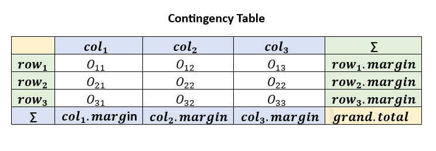
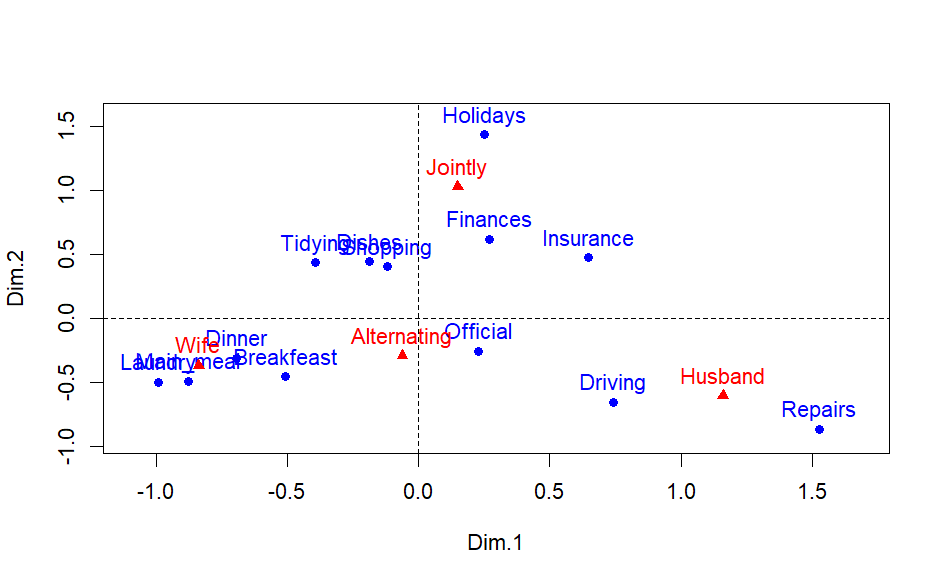

```{r setup, include=FALSE}
# clean up the environment
rm(list = ls())

# setup chunk options
knitr::opts_chunk$set(
  message = FALSE,
  warning = FALSE,
  fig.align = "center",
  comment = "#>"
)

options(scipen = 9999)
```

<style>
body {
text-align: justify}
</style>


Materi ini diproduksi oleh tim dari Algoritma untuk *Correspondence Analysis for Brand Personalities*. Materi berikut hanya ditujukan untuk kalangan terbatas, meliputi individu/personal yang menerima materi ini secara langsung dari lembaga pelatihan. Materi ini dilarang untuk direproduksi, didistribusikan, diterjemahkan, atau diadaptasikan dalam bentuk apapun di luar izin dari individu dan organisasi yang berkepentingan.

**Algoritma** adalah pusat pendidikan Data Science di Jakarta. Kami mengadakan workshop dan program pelatihan untuk membantu para profesional dan pelajar untuk mendapatkan keahlian dalam berbagai bidang dalam ruang lingkup Data Science: data visualization, machine learning, data modeling, statistical inference, dan lain-lainnya.

Sebelum masuk ke dalam materi dan menjalankan kode-kode di dalam materi ini, silakan Anda melihat bagian **Library and Setup** untuk melihat dan memastikan semua persyaratan dasar untuk mengikuti materi ini sudah terpenuhi termasuk package-package yang diperlukan. Pada bagian **Tujuan Pembelajaran** Anda dapat melihat secara umum apa saja yang akan dipelajari dalam modul materi ini. Kami harap materi ini akan bermanfaat bagi karir ataupun menambah keahlian peserta.


# Preface {.tabset}

## Pendahuluan

Istilah *“Brand Personality”* merujuk pada karakteristik sifat manusia yang dikaitkan dengan nama suatu brand. Perusahaan akan berusaha meningkatkan keuntungannya dengan cara memiliki seperangkat sifat konsisten yang disukai oleh target segmen konsumennya. Seperangkat sifat inilah yang disebut sebagai brand personality. Brand Personality merupakan aspek penting dari branding karena konsumen sering membuat keputusan pembelian berdasarkan seberapa cocok Brand Personality suatu produk dengan kepribadian mereka.

Perusahaan sebaiknya mendefinisikan Brand Personality mereka sehingga dapat menyasar konsumen atau pasar yang tepat untuk memaksimumkan profitnya. Brand personality juga menjadi sangat penting di tengah era digital ini dengan adanya Artificial Intelligence dan otomatisasi. Dengan demikian, pemetaan untuk brand personality dari tiap perusahaan dapat digunakan untuk mengembangkan strategi branding yang lebih efektif dan lebih sesuai dengan kebutuhan serta preferensi konsumen.

*Correspondence Analysis* adalah teknik statistik yang telah banyak digunakan dalam market research untuk memahami hubungan antara Brand Personality dan persepsi konsumen. Dengan analisis korespondensi, diperoleh plot yang menunjukkan interaksi dua variabel kategorik bersama yaitu variabel nama brand dan variabel brand personality. Sehingga dapat diketahui personality yang melekat dari masing-masing brand.

Materi ini bertujuan untuk memberikan pemahaman kepada peserta workshop terkait penggunaan Correspondence Analysis dalam mengidentifikasi Brand Personality dari suatu brand. Adapun setelah mempelajari materi ini peserta diharapkan dapat memahami kegunaan dan potensi Correspondence Analysis sesuai dengan proses bisnis pada bidang industri yang dijalani oleh peserta.

```{r echo=FALSE, out.width="100%"}
knitr::include_graphics(path = "assets/mindmap-ca.png")
```

## Library dan Setup

Untuk dapat mengikuti materi ini, peserta diharapkan sudah menginstall beberapa packages di bawah ini. Apabila package tersebut belum terinstall, silahkan jalankan chunk atau baris kode di bawah ini. Apabila sudah ter-install, lewati chunk tersebut dan muat package yang dibutuhkan dengan menjalankan chunk selanjutnya.

```{r eval=FALSE}
# install.packages(c("FactoMineR","factoextra", "dplyr", "ggpubr", "graphics", "ggplot2", "datasets"))
```


```{r}
#data wrangling
library("dplyr")

#data analysis
library("FactoMineR")
library("factoextra")

#data visualization
library("ggpubr") #untuk balloonplot
library("graphics") #untuk mosaicplot
library("ggplot2")

#data reference
library("datasets")
```


## Tujuan Pembelajaran

Tujuan utama dari workshop ini adalah untuk memberikan pengenalan yang komprehensif mengenai tools dan perangkat lunak yang digunakan untuk melakukan correspondence analysis, yakni sebuah open-source populer: R. Adapun materi ini akan mencakup:


- **Dasar Bahasa Pemrograman R**
    - Introduction to R programming language
    - Working with the RStudio environment
    - Using R markdown for reproducible research
    - Inspecting data structure
    - Data transformation
    - Data Visualization: ggplot2
    
- **Correspondence Analysis**
    - EDA for table contingency
    - Chi-Squares test
    - Correspondence analysis concept
    - Correspondence analysis interpretation
    
- **Studi Kasus**
    - Correspondence analysis for brand personalities

# Dasar Pemrograman di R

## Import Data

Analisa data di R dimulai dengan membaca data yang sudah tersedia. Terdapat banyak format penyimpanan data mulai dari yang terstruktur hingga yang tidak terstruktur. Salah satu format data yang sering digunakan yaitu `.csv`. Untuk membaca data dengan format `.csv` bisa menggunakan fungsi `read.csv()`.

```{r}
brand_df <- read.csv("data/brand.csv")
brand_df
```


**Deskripsi Data**

`brand_df` merupakan data yang akan digunakan pada implementasi Correspondence Analysis for Brand Personalities, diperoleh dari paper milik Jack Hoare & Tim Bock (2019). Data tersebut terdiri dari 29 brand (baris) dan 15 atribut personality (kolom). Data dikumpulkan menggunakan metode nonprobability sampling dari 3173 orang dewasa di Australia pada tahun 2005. Responden diminta untuk menentukan tiga atribut personality untuk setiap brand yang ditunjukkan.

```{r echo=FALSE, out.width="80%"}

```


Salah satu cara untuk melihat data adalah menggunakan fungsi `head()`

```{r}
#your code here
head(brand_df, n = 10)
```

Data di atas merupakan data brand dengan deskripsi dari setiap kolom sebagai berikut:      

- `Brand` : nama brand
- `charming` : skor atribut/personality "menarik"
- `cheerful` : skor atribut/personality "ceria"
- `daring` : skor atribut/personality "berani"
- `down_to_earth` : skor atribut/personality "bersahaja"
- `honest` : skor atribut/personality "jujur"
- `imaginative` : skor atribut/personality "imajinatif"
- `intelligent` : skor atribut/personality "cerdas"
- `outdoorsy` : skor atribut/personality "tipe luar ruangan"
- `reliable` : skor atribut/personality "dapat diandalkan"
- `spirited` : skor atribut/personality "bersemangat"
- `successful` : skor atribut/personality "sukses"
- `tough` : skor atribut/personality "tangguh"
- `up_to_date` : skor atribut/personality "terkini"
- `upper_class` : skor atribut/personality "kelas sosial atas"
- `wholesome` : skor atribut/personality "sehat/baik"

Untuk mengetahui 10 baris terakhir pada data, kita dapat menggunakan fungsi `tail()`.

```{r}
#your code here
tail(brand_df, n=10)
```


## Data Type and Structure

Kita sudah mempelajari bagaimana mengecek sampel dari data, sekarang kita perlu mengetahui tipe data dari masing masing kolom yang ada. Kita bisa menggunakan fungsi `glimpse()` untuk melihat struktur serta dimensi dari data.

```{r}
#your code here
library(dplyr)
glimpse(brand_df)
```
`brand_df` merupakan sebuah 'data.frame' atau tabel dengan 29 baris dan 16 kolom. Nama dari setiap kolom tertera di sebelah kanan (Brand, charming, dll). Teks `chr`, `int` menunjukkan tipe data dari masing - masing kolom.

### Data Type in R

Terdapat berbagai macam tipe data di R, berikut intuisi dari setiap tipe data tersebut.

```{r}
# character
a_char <- c("Algoritma", "Indonesia", "e-Commerce", "marketing")

# factor (data categorical)
a_factor <- factor(c("AB", "O", "B", "A", "B", "AB", "O"))

# numeric
a_num <- c(-1, 1, 2, 3/4, 0.5)

# integer
an_int <- c(1L, 2L)

# date
a_date <- c("24/Jan/2019", "10-12-1994")

# logical
a_log <- c(TRUE, TRUE, FALSE)
```

Cara untuk mengetahui tipe data dari suatu objek, Anda dapat menggunakan fungsi `class()`
```{r}
class(a_factor)
```

Lalu, apa yang akan terjadi jika dalam satu vector memiliki beberapa tipe data yang berbeda seperti chunk dibawah ini?

```{r}
mix <- c("Algoritma", 2021, TRUE)
mix
```

Bila Anda perhatikan setiap nilai pada vector `mix` memiliki *petik dua*, artinya nilai tersebut merupakan sebuah objek dengan tipe character. Proses perubahan paksa dari suatu vector bisa disebut sebagai *implicit coercion*. Ilustrasi terjadinya implicit coercion dapat dilihat pada gambar di bawah ini:

```{r echo = F}

```

```{r}
#your code here
class(mix)
```


## Data Preprocessing

Ketika melakukan analisis pada suatu data tidak jarang data yang dimiliki tidak dapat langsung digunakan. Beberapa tahapan perlu dilakukan seperti subseting data, membuat kolom baru, sampai melakukan aggregasi data. Hal tersebut penting dilakukan agar seorang analis paham betul dengan data yang diolah dan sesuai dengan analisis yang diinginkan. 

### Data Aggregation: Create Contingency Table

> Tabel kontingensi atau cross-tabulation adalah tabel yang berisi nilai frekuensi/kemunculan suatu kategori data.

Correspondence Analysis memerlukan input yang disebut sebagai **tabel kontingensi**. Tabel kontingensi terdiri dari baris dan kolom, dengan setiap baris mewakili kategori dari variabel pertama, dan setiap kolom mewakili kategori dari variabel kedua.

```{r echo = F}

```

Jika kita memiliki **dataframe** biasa dimana terdapat beberapa kolom dengan tipe data yang berbeda-beda (biasanya tipe kategorik dan numerik), perlu dilakukan data aggregation untuk membentuk tabel kontingensi.

Untuk pembelajaran pembuatan tabel kontingensi dari dataframe, perhatikan dataframe buit in di R dari package `datasets` yang dapat dipanggil dengan nama `esoph` berikut.

```{r}
# Memanggil data esoph
library(datasets)
esoph
```
Data esoph adalah data dari studi kasus-kontrol kanker esofagus di Ille-et-Vilaine, Prancis. Terdiri dari 88 observasi dan 5 kolom, dengan deskripsi sebagai berikut.

- `agegp` : Kelompok usia (25-34, 35-44, 45-54, 55-64, 65-74, 75+)
- `alcgp` : Konsumsi alkohol (0-39g/day, 40-79, 80-119, 120+)
- `tobgp` : Konsumsi tembakau (0-9g/day, 10-19, 20-29, 30+)
- `ncases` : Jumlah kasus kanker
- `ncontrols` : Jumlah kontrol

Data esoph di atas dapat kita bentuk menjadi tabel kontingensi menggunakan fungsi `table()` di R. 

> Fungsi table() adalah untuk menampilkan frekuensi tiap kategori dari dua variabel

Untuk membuat tabel kontingensi, pertama-tama kita harus mengidentifikasi variabel kategorik mana yang ingin dianalisis. Misalkan kita ingin menganalisis hubungan dari kelompok usia seseorang dengan konsumsi tembakau. Berikut akan dibuat tabel kontingensi dari variabel `agegp` dan `tobgp`.

```{r}
#your code here
table(esoph$agegp, esoph$tobgp)
```
Tabel kontingensi di atas menunjukkan jumlah orang-orang di Ille-et-Vilaine yang berusia kategori usia tertentu dengan ketegori konsumsi tembakau tertentu. 

Insight:

* Baris akan mewakili kategori dari variable agegp (kelompok usia)
* Kolom akan mewakili kategori dari variable tobgp (kelompok konsumsi tembakau)
* Setiap sel dalam tabel akan menunjukkan frekuensi dari variabel agegp dan tobgp. Misalnya angka 1 di baris ke-6 dan kolom ke-3 itu menunjukkan frekuensi orang yang punya kelompok usia 75+ dengan konsumsi tembakau 20-29 g/hari.

Untuk menginterpretasikan tabel kontingensi, Anda dapat melihat frekuensi di setiap sel, dan membandingkannya dengan frekuensi di sel lain melintasi baris dan kolom. Anda juga dapat menghitung persentase atau proporsi untuk lebih memahami distribusi pengamatan. Correspondence Analysis yang akan kita bahas merupakan salah satu teknik advance untuk interpretasi tabel kontingensi.

**Question?**

Apakah data `brand_df` merupakan tabel kontingensi?
```{r}
brand_df
```
Jawaban: brand_df bukan merupakan tabel kontingensi, karena tabel kontingensi seharusnya punya index kolom dan index baris, sementara brand_df belum memiliki index baris (index baris menjadi isi dari suatu kolom)

### Feature Engineering

Untuk membuat data`brand_df` menjadi tabel kontingensi, kolom `Brand` akan dijadikan indeks baris. Sehingga index baris pada tabel menunjukkan variabel brand dan index kolom menunjukkan atribut personality.
```{r}
# Assign nilai dari kolom brand menjadi index baris
rownames(brand_df) <- brand_df$Brand
brand_df
```
```{r}
# Membuang kolom yang tidak digunakan
brand_table <- brand_df %>% 
  select(-Brand)

brand_table
```
```{r}
#Alternative cara buat index baris utk contingency table (Pak Alif Aziz)
read.csv("data/brand.csv", row.names = 'Brand')
```

# Data Visualization

## EDA for Contingency Table 

Sebelum melakukan analisis, kita harus mengenali data yang akan kita gunakan yaitu `brand_table` yang merupakan contingency table dengan baris adalah nama brand dan kolom adalah atribut-atribut personality. Kita dapat dengan cepat memperoleh rangkuman dari data kita yang berisi five number summary menggunakan fungsi `summary()` di R.

```{r}
summary(brand_table)
```

Nama brand sudah kita jadikan index row sehingga summary hanya ditampilkan untuk setiap kolom yang ada pada data yang merupakan atribut personality. Dikarenakan tujuan analisis kali ini adalah ingin mengidentifikasi atribut personality yang melekat pada tiap brand, maka nilai statistik yang menarik untuk diperhatikan adalah nilai maksimum. 

Insight:

* terdapat brand yang dikenal “charming” dengan perolehan suara maksimum sebanyak 59
* terdapat brand yang dikenal “cheerful” dengan perolehan suara maksimum sebanyak 64
* terdapat brand yang dikenal “upper_class” dengan perolehan suara maksimum sebanyak 94
* terdapat brand yang dikenal “wholesome” dengan perolehan suara maksimum sebanyak 80

Dari summary, kita bisa mendapatkan bahwa terdapat beberapa atribut personality yang nilai maksimumnya sangat tinggi dibanding atribut lainnya. Sepertinya, semakin tinggi nilai maksimum untuk suatu atribut personality pada suatu brand maka semakin yakin suara dari para responden. Karena nilai yang maksimum dihasilkan dari suara banyak responden yang memberikan skor tinggi..

Meskipun fungsi summary memberikan rangkuman data, kita tetap kesulitan untuk menginterpretasikan data. Sehingga kita perlu suatu visualisasi untuk membantu kita menjelaskan data. Dikarenakan data input kita spesial yaitu merupakan tabel kontingensi, maka akan dikenalkan visualisasi khusus untuk tabel kontingensi.

### Balloon plot

Balloon plot adalah salah satu jenis plot untuk memvisualisasikan data kategorik yang berukuran besar.

> Fungsi balloon plot adalah membuat tabel grafis dimana setiap sel menampilkan lingkaran berwarna yang ukurannya mencerminkan besar nilainya.

Secara visual, plot ini dapat menghighlight poin data yang nilainya menonjol ditunjukkan semakin besarnya lingkaran. Prinsip dasar pada ballon plot, semakin besar ukuran lingkaran maka semakin besar pula nilai datanya.

```{r, fig.height=6.7}
ggballoonplot(brand_table) +
  labs(title = "Balloonplot for Brand Personalites") +
  theme(plot.title = element_text(hjust = 0.5))
```

Untuk memudahkan kita dalam membaca ballon plot, kita dapat memberikan warna untuk perbedaan ukuran lingkaran pada ballon plot seperti sebagai berikut.

```{r, fig.height=6.7}
my_cols <- c("#0D0887FF", "#6A00A8FF", "#B12A90FF","#E16462FF", "#FCA636FF", "#F0F921FF")
ggballoonplot(brand_table, fill = "value") +
  scale_fill_gradientn(colours = my_cols) +
  labs(title = "Balloonplot for Brand Personalites") +
  theme(plot.title = element_text(hjust = 0.5))
```

Plot di atas sudah dimodifikasi agar warna lingkaran juga dapat menunjukkan besarnya nilai, yaitu warna kuning menunjukkan nilai yang semakin besar sementara warna navy menunjukkan nilai semakin kecil. Pada ballon plot di atas, dapat diketahui bahwa terdapat beberapa brand dengan nilai frekuensi atribut yang tinggi dibanding brand lainnya. 

Dari balloon plot di atas, kita dapat melihat bahwa:

* Jika menyebut brand yang outdoorsy atau brand yang biasa digunakan untuk kegiatan di luar ruangan, berdasarkan plot maka brand yang langsung dipikirkan adalah Nike dan Reebok.
* Brand yang memiliki atribut personality upper class adalah Porsche, Mercedes, dan Calvin Klein
* Porsche sangat tidak down to earth, artinya harganya tidak murah
* Avoncosmetics perlu rebranding produknya, brandnya tidak punya kecenderungan tertentu di salah satu personalities kak

Dengan menggunakan balloon plot kita dapat dengan cepat menginterpretasikan data kategorik meskipun kita memiliki data yang berukuran besar.

Balloonplot interactive:
```{r, fig.height=6.7}
library(plotly)
plot1 <- ggballoonplot(brand_table, fill = "value") +
  scale_fill_gradientn(colours = my_cols) +
  labs(title = "Balloonplot for Brand Personalites") +
  theme(plot.title = element_text(hjust = 0.5))

#Catatan: perlu disesuaikan tinggi & lebar plot
ggplotly(plot1,height = 800, width = 800)
```

### Mosaic Plot

Mosaic plot digunakan untuk memvisualisasikan tabel kontingensi dan untuk memeriksa hubungan antara variabel kategori. Untuk setiap sel, tinggi batang sebanding dengan frekuensi relatif yang diamati yang dikandungnya:

$$ \frac{cell.value}{column.sum}$$

Warna pada plot menunjukkan standardized residuals, yang memberikan intuisi signifikansi hubungan. Standardized residuals adalah akar dari statistik Chi-square yang akan dibahas pada section selanjutnya.

Mosaic plot dapat diinterpresaikan sebagai berikut:

* Sebuah sel diarsir biru jika kita yakin bahwa sel tersebut lebih tinggi dari sel lain dalam baris yang sama
* Sebuah sel diarsir dengan warna merah jika kita yakin bahwa sel tersebut lebih rendah dari sel lain pada baris yang sama

Formula: `mosaicplot()` dengan parameter:

* `data`
* `las`: style of axis label (1/2)
* `shade = T` -> colour gradient
* `off`: spacing of cell
* `main`: title of plot

```{r, fig.height=6.7}
# Mosaic plot of observed values
mosaicplot(brand_table,
           las = 2,
           shade = T,
           off = 25,
           main = "Mosaic plot for brand personalities")
```

Dari mosaic plot di atas, kita dapat melihat bahwa:

* Brand avoncosmetics, CalvinKleinPerfume, Hallmarks Cards, OlofOlayLotion, dan RevlonCosmetics memiliki persona charming dibanding brand lain
* Brand MattelToys, McDonald’s, dan PepsiCola memiliki persona cheerful dibanding brand lain
* Brand LeeJeans, Levi’sJeans, Michelin Tires, Nike dan Reebok memiliki persona outdoorsy dibanding brand lain
* Brand American Express, CalvinKleinPerfume, Guess Jeans, Lexus, Mercedes, dan Porsche memiliki persona upper_class dibanding brand lain
* Campbel’s Soup, Colgate Toothpaste, Kmart, dan OlofOlayLotion memiliki persona wholesome dibanding brand lainn


# Chi-Square Test

> Uji chi-square adalah sebuah tes statistik yang membantu kita menentukan apakah ada hubungan yang signifikan antara dua variabel kategorik.

Uji ini sering digunakan dalam social science research, studi medis, dan bidang lain di mana kita ingin memeriksa hubungan antara variabel.

Sebagai contoh, misalnya kita ingin mengetahui apakah terdapat hubungan yang signifikan antara usia seseorang dengan tingkat merokok. Kita bisa mengumpulkan data dari sekelompok orang dan menggunakan uji chi-square untuk melihat apakah ada perbedaan yang signifikan kelompok usia tertentu dengan tingkat merokoknya.

Uji hipotesis untuk Chi-Square Test adalah sebagai berikut.

* $H_0$ : Variabel baris dan kolom dari tabel kontingensi adalah independen
* $H_1$ : Variabel baris dan kolom adalah dependen (memiliki hubungan yang signifikan)

```{r echo = F, out.width="70%"}

```


Untuk sel tertentu pada contingency table, nilai yang diharapkan dihitung sebagai berikut:
$$E_{ij}=\frac{row_i.marginal * column_j.marginal}{grand.total}$$

Statistik Chi square dihitung sebagai berikut:
$$χ^2= \sum\frac{(O_{ij} - E_{ij})^2}{E_{ij}}$$

keterangan:

* χ2 = Statistik Chi-square
* Oi = Nilai observasi (pengamatan) ke-i
* Ei = Nilai ekspektasi ke-i

Catatan:

* Statistik Chi-square yang dihitung ini dibandingkan dengan nilai kritis (diperoleh dari tabel statistik) dengan derajat kebebasan df = ( r − 1 ) ( c − 1 ) dan alpha = 0,05. r adalah jumlah baris dan c adalah jumlah kolom pada tabel kontingensi.
* Jika statistik Chi-kuadrat yang dihitung lebih besar dari nilai kritis atau **p-value < 0.05**, maka kita dapat menyimpulkan bahwa variabel baris dan kolom tidak independen satu sama lain. Sehingga mereka dikatakan terkait atau **memiliki hubungan secara signifikan**.
* Di R, kita bisa melakukan chi-square test dengan menggunakan fungsi `chisq.test()`.

**Question**

Uji hipotesis Chi-Square Test untuk menguji apakah ada perbedaan yang signifikan kelompok usia tertentu dengan tingkat merokoknya.

* $H_0$ : Tidak ada hubungan antara kelompok usia dan tingkat merokoknya (independen)
* $H_1$ : Ada hubungan antara kelompok usia dan tingkat merokoknya

```{r}
#chi_squared test in R
#chisq.test(kolom_kategorikal, kolom_kategorikal)
chisq.test(esoph$agegp, esoph$tobgp)
```
Catatan: Tolak H0 jika pvalue < 0.05

Kesimpulan: p-value = 0.9999 > 0.05, gagak tolak H0 maka tidak ada hubungan antara kelompok usia dan tingkat merokoknya

Question: Bagaimana melakukan chi-square test pada tabel kontingensi `brand_table`
```{r}
chisq.test(brand_table)
```


# Correspondence Analysis Concept

Correspondence Analysis (CA) adalah jenis teknik dimentionality reduction yang dapat digunakan untuk **memvisualisasikan dan mengeksplorasi hubungan variabel kategorikal** dalam sebuah dataset.

Analisis korespondensi (CA) diperlukan untuk tabel kontingensi besar untuk memvisualisasikan titik baris dan titik kolom secara grafis dalam ruang berdimensi dua dimensi.

Plot hasilnya menampilkan:

* hubungan antara kategori baris dan kolom
* setiap titik mewakili kategori
* jarak antara titik mencerminkan kekuatan hubungan antara kategori tersebut

Misal kita ingin menganalisis apakah terdapat hubungan antara tipe pekerjaan rumah dengan role keluarga. CA akan menghasilkan plot berikut untuk menunjukkan hubungan dari kedua variabel tersebut.
```{r echo = F, out.width="90%"}

```
Glossary:

1. Standardized residual: ukuran signifikansi hubungan yang berasal dari statistik chi-square
2. Row marginal/ margin baris: jumlah frekuensi per baris
3. Column marginal/margin kolom: jumlah frekuensi per kolom
4. Singular Value Decomposition (SVD): prosedur dekomposisi matriks untuk mendapatkan eigen value dan eigen vector
5. Singular value: nilai diagonal dari matriks diagonal yang dihasilkan SVD
6. Eigen value (sv^2): variansi yang dipertahankan oleh setiap dimensi 
7. Eigen vector baris (U): komponen koordinat baris pada CA
8. Eigen vector kolom (v): komponen koordinat kolom pada CA
9. matriks ortogonal: matriks yang memiliki invers yang sama dengan transposenya
10. matriks diagonal: matriks yang nilainya hanya terdapat pada diagonalnya, sementara elemen lainnya bernilai nol.

# Implementasi Correspondence Analysis for Brand Personalities

Pada bagian sebelumnya kita sudah melakukan eksplorasi data pada data brand. Sekarang kita akan menerapkan CA untuk menganalisis hubungan variabel brand dan personality pada data brand CA pada data brand akan membantu kita memperoleh plot visualisasi untuk mengidentifikasi personality pada setiap brand.

Untuk melakukan CA, dapat digunakan fungsi `CA()` dari package `factomineR` 

`CA(X, ncp = 5, graph = TRUE)`

Keterangan:

* `X`: data (tabel kontingensi)
* `ncp`: jumlah dimensi yang disimpan di hasil akhir.
* `graph`: nilai boolean. Jika TRUE grafik ditampilkan.


```{r}
brand.ca <- CA(brand_table, graph = FALSE)
brand.ca
```

Dalam menginterpretasikan hasil dari analisis korespondensi, terdapat beberapa output yang dihasilkan yaitu statistik Chi-square, nilai Eigen, komponen baris dan komponen kolom. Selanjutnya, akan dibahas satu per satu terkait output ini.

## Chi-Square Test

Untuk menginterpretasikan CA, perlu dilakukan uji chi square untuk memeriksa hubungan antara variabel brand dan variabel atribut personality.

Dengan rumusan hipotesis sebagai berikut.

* $H_0$ : Tidak ada hubungan antara brand dan personality (independen)
* $H_1$ : Ada hubungan antara brand dan personality

Catatan: H0 ditolak jika pvalue < 0.05

Kesimpulan: p-value = 0 maka H0 ditolak, artinya ada hubungan antara brand dan personality


## Nilai Eigen/ Variance

Sama seperti di PCA, eigen atau variance juga menunjukkan banyak informasi yang dipertahankan oleh setiap dimensi. Dimensi 1 menjelaskan variansi terbanyak, diikuti oleh dimensi 2 dan seterusnya. Pada summary `brand.ca` kita dapat memanggil nilai eigen dengan `$eig`.

```{r}
brand.ca$eig
```
Note: pada data brand, menggunakan 2 dimensi CA berhasil merangkum data kita sebesar 62.98512%

## Rows Components

Komponen fungsi `brand-ca$row` berisi:

* `$coord`: koordinat setiap titik baris pada setiap dimensi (1,2,dst). Digunakan untuk membuat plot.
* `$cos2`: kualitas representasi baris.
* `$contrib`: kontribusi baris (dalam %) terhadap definisi dimensi.

### Rows Coordinat

CA menghasilkan koordinat baru untuk variabel baris pada dimensi baru, yang dapat dipanggil dengan `$coord`.
```{r}
brand.ca$row$coord
```

Gunakan fungsi `fviz_ca_row()` [in factoextra] untuk memvisualisasikan hanya titik baris:
```{r}
fviz_ca_row(brand.ca, repel = TRUE)
```


Kita dapat mengidentifikasi kesamaan atau ketidaksamaan dalam kategori baris dengan memperhatikan jarak antar titik koordinat baris.

* Baris dengan profil serupa akan memiliki titik koordinat yang berdekatan (karakteristik mirip)
* Kategori baris yang memilki hubungan negatif atau bertolak belakang akan memiliki titik koordinat yang berada pada kuadran yang berlawanan (karakteristik tidak mirip)

Sehingga, berdasarkan plot titik koordinat baris insight yang didapatkan adalah:

* Nike, Reebok, Levi's Jeans, dan Michelin Tires berada berdekatan dan dalam satu kuadran yang sama. Nampaknya keempat brand ini memiliki kemiripan personality outdoorsy jika ditelusuri lewat ballon plot.
* IBM, Apple, Sony memiliki personality yang mirip
* Toyota dan Mercedes Benz tidak mirip padahal sama-sama produsen mobil (mungkin branding personality yang dibangun sangat berbeda)

### Quality of representation of rows

CA dapat merangkum data dan memvisualisasikannya dalam plot dua dimensi. Perhatikan bahwa dua dimensi baru (dimensi 1 & 2) dapat mempertahankan 62.89% dari variasi yang terkandung dalam data. Namun, tidak semua titik data ditampilkan dengan sama baiknya dalam dua dimensi. Kualitas representasi baris pada peta faktor disebut cosinus kuadrat (cos2).
$$cos2 = \frac{row.coord^2}{d^2}$$
dengan row.coord adalah koordinat baris pada sumbu $d^2$ adalah jarak kuadrat dari rata-rata profil baris.
```{r}
head(brand.ca$row$cos2)
```

Catatan:
* Nilai cos2 adalah 0 sampai 1
* Jika kategori baris terwakili dengan baik oleh dua dimensi, jumlah dari cos2 mendekati 1

Berikut divisualisasikan nilai cos2 untuk masing-masing brand. Semakin oranye warna suatu brand, semakin bagus kualitas representasi suatu brand tersebut pada plot CA.
```{r}
# Color by cos2 values: quality on the factor map
fviz_ca_row(brand.ca, col.row = "cos2",
             gradient.cols = c("#00AFBB", "#E7B800", "#FC4E07"), 
             repel = TRUE,
            title="Row Poins based on Their Quality Cos2")
```


Note: semakin dekat suatu titik koordinat dengan pusat kuadran, biasanya semakin sedikit informasi yang diperoleh. Sehingga umumnya titik koordinat yang jauh dari kuadran yang memiliki banyak insight

### Contributions of rows to the dimensions

Variabel baris dengan nilai yang lebih besar, berkontribusi paling besar terhadap definisi dimensi. Baris yang paling berkontribusi pada Dim.1 dan Dim.2 adalah yang paling penting dalam menjelaskan variabilitas dalam kumpulan data.
```{r}
head(brand.ca$row$contrib)
```

Besar kontribusi variabel baris pada dimensi 1 dan 2 dapat dilihat dengan visualisasi berikut:
```{r}
# Contributions of rows to dimension 1
fviz_contrib(brand.ca, choice = "row", axes = 1)

# Contributions of rows to dimension 2
fviz_contrib(brand.ca, choice = "row", axes = 2)
```

Insight:

* Kategori baris yang paling berkontribusi besar pada dimensi 1 adalah Campbell Soup
* Kategori baris yang paling berkontribusi besar pada dimensi 2 adalah Lee Jeans


## Columns Components

Interpretasi untuk komponen kolom sama persis dengan komponen baris. 

Komponen fungsi `brand-ca$col` berisi:

* `$coord`: koordinat setiap titik kolom pada setiap dimensi (1,2,dst). Digunakan untuk membuat plot.
* `$cos2`: kualitas representasi kolom.
* `$contrib`: kontribusi kolom (dalam %) terhadap definisi dimensi.

```{r}
# Koordinat kolom
head(brand.ca$col$coord)

# Kualitas representasi tiap kategori kolom pada plot 2 dimensi
head(brand.ca$col$cos2)

# Kontribusi tiap kategori kolom ke dimensi CA
head(brand.ca$col$contrib)
```


Seperti titik baris, titik kolom juga dapat diwarnai berdasarkan kualitas representasinya pada plot CA yang ditunjukkan nilai cos2:
```{r}
fviz_ca_col(brand.ca, col.col = "cos2", 
             gradient.cols = c("#00AFBB", "#E7B800", "#FC4E07"),
             repel = TRUE)
```

Sementara itu, untuk memvisualisasikan kontribusi kolom ke dua dimensi pertama:
```{r}
# Contributions of columns to dimension 1
fviz_contrib(brand.ca, choice = "col", axes = 1)

# Contributions of columns to dimension 2
fviz_contrib(brand.ca, choice = "col", axes = 2)
```

Insight:

* Kategori kolom yang paling berkontribusi besar pada dimensi 1 adalah upper class
* Kategori kolom yang paling berkontribusi besar pada dimensi 2 adalah outdoorsy


# Interpretasi Biplot CA

Plot standar analisis korespondensi adalah biplot simetris di mana baris (titik biru) dan kolom (segitiga merah) direpresentasikan dalam ruang yang sama menggunakan koordinat baru.

Biplot pada CA artinya gabungan dua plot, yaitu **plot untuk variabel baris** dan **plot untuk variabel kolom**. Koordinat pada biplot CA mewakili profil baris dan kolom. Biplot CA di R dapat diperoleh menggunakan fungsi `fviz_ca_biplot(ca objek, repel = TRUE)`

```{r}
fviz_ca_biplot(brand.ca, repel = TRUE)
```

Berikut adalah beberapa poin yang perlu diperhatikan dalam menginterpretasi biplot CA:

* Kedekatan titik kategori dengan titik asal menunjukkan **kekhasan kategori** tersebut
  + Jika titik kategori terletak dekat dengan titik asal plot menunjukkan bahwa kategori tersebut kurang berbeda dari kategori lainnya atau kurang khas
  + Semakin jauh suatu kategori dari titik asalnya, semakin diskriminatif kategori tersebut, yang menunjukkan bahwa kategori tersebut memiliki karakteristik khas yang membedakannya dari kategori lain
* Kedekatan suatu titik dengan titik lainnya dalam konteks baris atau kolom menunjukkan kesamaan profil/karakteristik **(similarity)**, jika data discaling dengan benar. Namun fungsi `CA()` sudah secara otomatis melakukan scaling.
* Untuk mengetahui **hubungan dari kategori baris dan kategori kolom** dilihat dari seberapa besar sudut yang terbentuk dari panah baris dan kolom ke titik asalnya. Tambahkan parameter `arrow` untuk menampilkan panah baris dan kolom pada biplot.

```{r}
fviz_ca_biplot(brand.ca, repel = TRUE, arrows = c(TRUE, TRUE))
```

Cara interpretasi hubungan dari kategori baris dan kategori kolom:

+ sudut panah baris (biru) dan panah kolom (merah) mendekati 0: kategori baris dan kolom memiliki hubungan positif
+ sudut 90 derajat: kategori baris dan kolom tidak memiliki hubungan
+ sudut 180 derajat: kategori baris dan kolom memiliki hubungan negatif
+ Semakin jauh suatu titik dari titik asalnya, semakin kuat hubungannya dengan suatu kategori lain sesuai kriteria sudutnya (positif/negatif)

Dengan demikian, berdasarkan profil baris (personality), berikut adalah pemetaan untuk data brand personality:

* Tough & spirited: Nike, Reebok, Levi's Jeans dan Michelin Tires
* Daring: GuessJeans
* Upper_class: CalvinKleinPerfume, AmericanExpress, Lexus
* Charming: Revlon Cosmetics, Apple
* Down_to_eart: Kmart
* Wholesome: Campbell's Soup, Avoncosmetics

# Kesimpulan

Correspondence Analysis memberikan hasil visualisasi yang mudah diinterpretasi sehingga kita dengan mudah menemukan asosiasi dari dua kategori variabel. CA dapat membantu kita mendefinisikan personality (variabel kolom) dari suatu brand (variabel baris). Sebelumnya, telah dibahas juga detail komponen analisis korespondensi dan intuisi matematikanya. Berdasarkan analisis yang telah dilakukan, diperoleh terdapat beberapa pemetaan personality untuk brand-brand yang ada. Jika dibandingkan dengan ballon plot dan mosaicplot, ada beberapa hasil pemetaan yang sama. Namun, CA memberikan hasil pemetaan yang lebih kuat dengan memvisualisasikan hubungan kedua variabel pada biplot.

Setelah mengetahui pemetaan personality untuk masing-masing brand, perusahaan dapat memaksimalkan marketingnya dengan memperkuat personality yang telah melekat serta merumuskan strategi brand positioning.

**Correspondence Analysis Workflow**

1. Import Data
2. Data Preprocessing: Contingency Table
3. EDA: Ballonplot & Mosaicplot (Optional)
4. Chi-Square Test
5. Row component & column component
6. Biplot Interpretation

# Reference

* [How to create contingency table](https://sphweb.bumc.bu.edu/otlt/MPH-Modules/PH717-QuantCore/PH717-Module3-Frequency-Association/PH717-Module3-Frequency-Association14.html)
* [Correspondence Analysis Paper](https://www.sciencedirect.com/topics/earth-and-planetary-sciences/correspondence-analysis)
* [Correspondence Analysis for Brand Personalities Paper](https://journals.sagepub.com/doi/10.1177/1470785318801480)
* [3D Correspondence Analysis with plotly](https://www.displayr.com/3d-correspondence-analysis-plots-in-r-using-plotly/)
* [Adding Outliers as Supplementary Elements to a Correspondence Analysis](http://www.sthda.com/english/articles/31-principal-component-methods-in-r-practical-guide/113-ca-correspondence-analysis-in-r-essentials/)
* [Multiple Correspondence Analysis (MCA)](http://www.sthda.com/english/articles/31-principal-component-methods-in-r-practical-guide/114-mca-multiple-correspondence-analysis-in-r-essentials/)


